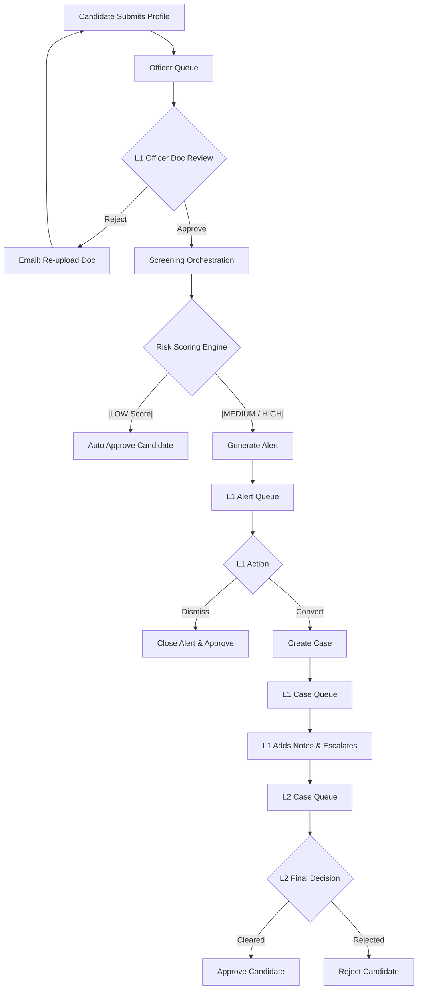
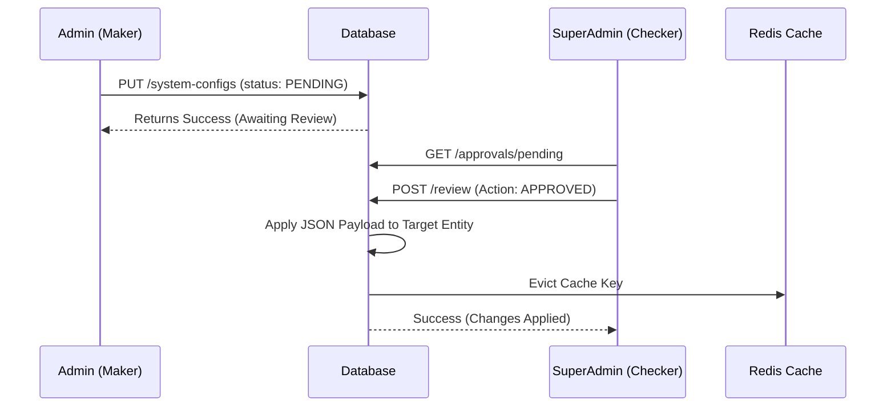

# OnboardGuard Backend 🛡️

## 1. Project Overview
OnboardGuard is a comprehensive, enterprise-grade Compliance, Anti-Money Laundering (AML), and Know Your Customer (KYC) Screening Portal. Designed for highly regulated environments, it manages the end-to-end lifecycle of candidate and vendor onboarding.

The system facilitates secure document collection, manual Officer-led verification (Maker/Checker), automated risk scoring against global sanction/watchlist databases, SLA-tracked investigations, and comprehensive business auditing.

## 2. Architecture & Design

### High-Level Architecture
The project follows a **Modular Monolith** architecture built on Domain-Driven Design (DDD) principles.

* **Layered Structure**: `Controller` (Web/API boundary) → `Service` (Business Logic) → `Repository` (Data Access).
* **CQRS Pattern (Light)**: PostgreSQL acts as the definitive Source of Truth (SoT). Elasticsearch is asynchronously synced via `@TransactionalEventListener` to handle complex fuzzy, full-text watchlist searches.
* **Event-Driven Workflows**: Spring Application Events (`BusinessLogEvent`, `CaseResolvedEvent`, `AlertGeneratedEvent`) decouple core logic from side effects like email notifications and audit logging.
* **Pessimistic Locking & FIFO Queues**: Uses database-level locks (`@Lock(LockModeType.PESSIMISTIC_WRITE)`) and `SKIP LOCKED` (`jakarta.persistence.lock.timeout = -2`) to prevent concurrent L1/L2 Officers from claiming the same candidate, alert, or case.
* **Strategy Pattern**: The risk screening engine dynamically switches between `BasicScreeningStrategy` and `AdvancedScreeningStrategy` based on system configurations.

### Flow Logic Diagrams

#### 1. End-to-End Onboarding & Screening Flow


#### 2. Maker-Checker System Configuration Flow


## 3. Tech Stack
* **Core Framework**: Java 17, Spring Boot 3.5.13
* **Database**: PostgreSQL (Primary) / H2 (Testing)
* **Search Engine**: Elasticsearch 8+ (Remote/Cloud Enterprise configured)
* **Caching**: Redis (Lettuce Client)
* **ORM / Auditing**: Spring Data JPA, Hibernate Envers
* **Security**: Spring Security, JWT (`jjwt-api` 0.12.6)
* **Object Mapping**: MapStruct 1.5.5.Final, Lombok
* **Cloud Storage**: Cloudinary (Image/PDF validation & 15-min Presigned URLs)
* **Mailing**: Spring Boot Mail + Thymeleaf HTML Templates
* **Build Tool**: Maven (`spring-boot-maven-plugin`)

## 4. Project Structure
The codebase is partitioned by bounded contexts:

* **`admin/`**: User provisioning, Audit Log timeline (Business Diary), Maker-Checker approval ledger, and Dashboard statistics aggregation.
* **`auth/`**: Registration, Authentication, secure Officer Credential generation, and Redis-backed Token Blacklisting.
* **`candidate/`**: Candidate profile building, KYC document upload logic, and Queue management queries.
* **`officer/`**: Workflow handlers for L1 (Alert/Case triage, Doc Verification) and L2 (Escalation Resolution), plus SLA breach monitoring crons.
* **`screening/`**: Risk Scoring Engine, basic/advanced matching algorithms, and Jaro-Winkler utility logic.
* **`watchlist/`**: Dictionary definitions, Alias mapping, Evidence storage, and real-time Elasticsearch syncing.
* **`shared/`**: Global exception handlers, Base Entities, JWT configurations, Redis/Cloudinary adapters, and Application Events.

## 5. Deep Dive: Risk Screening Logic & Scoring Weights

The `RiskScoringEngine` dynamically loads configurations from Redis/PostgreSQL. It analyzes individual `ScreeningMatch` contributions using the exact formula:

**`Contribution = (BasePoints * SourceCredibility * CorroborationMultiplier) + CategoryBonus`**

*Final Candidate Risk Score is the sum of all match contributions (Capped at 100.0).*

### Base Match Points
| Match Type | Condition | Base Points |
| :--- | :--- | :--- |
| **NAME_EXACT** | Case-insensitive exact match | 40.0 |
| **NAME_FUZZY** | Jaro-Winkler Score $\ge$ 0.80 | 25.0 |
| **NAME_ALIAS_EXACT**| Exact match on known alias | 20.0 |
| **NAME_ALIAS_FUZZY**| Fuzzy match on known alias | 20.0 |
| **PAN_EXACT** | Alphanumeric exact match | 35.0 |
| **AADHAAR_EXACT** | 12-digit exact match | 30.0 |
| **ORG_EXACT** | Exact organization name | 20.0 |
| **ORG_FUZZY** | Fuzzy organization name | 20.0 |
| **DESIGNATION_EXACT**| Exact role (e.g. Director) | 15.0 |

### Corroboration Multipliers
Applied to mitigate false positives when multiple datapoints converge.
| Corroboration Level | Multiplier Value |
| :--- | :--- |
| Name Only | 0.5x |
| Name + 1 ID (PAN or Aadhaar) | 0.8x |
| Name + 2 IDs (PAN and Aadhaar) | 1.0x |
| Name + Organization | 0.75x |
| Name + Org + Designation | 1.0x |

### Add-on Bonuses
* **CRIMINAL Category Hit**: +15.0 pts
* **PEP (Politically Exposed) Hit**: +15.0 pts
* **HIGH Severity Source Hit**: +10.0 pts

### Risk Classification Thresholds
* **LOW**: 0.0 - 30.99 $\rightarrow$ Status: `CLEAR` (Auto-Approves)
* **MEDIUM**: 31.0 - 60.99 $\rightarrow$ Status: `FLAGGED` (Generates Alert)
* **HIGH**: 61.0 - 100.0 $\rightarrow$ Status: `FLAGGED` (Generates Alert)

## 6. Complete API Documentation

*(All protected endpoints expect a standard `Authorization: Bearer <JWT>` header).*

### Auth Controller (`/api/v1/auth`)
| Method | Endpoint | Description | Request Example | Response Example |
| :--- | :--- | :--- | :--- | :--- |
| POST | `/login/candidate` | Candidate Authentication | `{"email":"test@x.com","password":"123"}` | `{"success":true,"data":{"token":"eyJ...","email":"test@x.com","fullName":"John","expiresInSeconds":900}}` |
| POST | `/login/staff` | Staff/Admin Auth | `{"email":"admin@x.com","password":"123"}` | `{"success":true,"data":{"token":"eyJ...","roleCode":"ROLE_ADMIN"}}` |
| POST | `/register/candidate`| Candidate Signup | `{"fullName":"John","email":"test@x.com","password":"123","phone":"1234"}` | `{"success":true,"data":{"token":"eyJ..."}}` |
| POST | `/logout` | Invalidates JWT via Redis | `{}` | `{"success":true,"message":"Logged out successfully"}` |

### Admin Management (`/api/v1/admin`)
| Method | Endpoint | Description | Request Example | Response Example |
| :--- | :--- | :--- | :--- | :--- |
| POST | `/users/officers` | Provision L1/L2 Officer | `{"fullName":"X","email":"x@x.com","role":"ROLE_OFFICER_L1"}`| `{"success":true,"message":"Officer provisioned"}` |
| GET | `/users` | Paginated User Grid | `?page=0&size=20` | `{"success":true,"data":{"content":[{"email":"..."}]}}` |
| PATCH| `/users/{id}/status`| Activate/Deactivate User | `?isActive=true` | `{"success":true,"message":"User activated"}` |
| GET | `/audit-logs/timeline`| Business History Ledger | `?entityType=CASE&entityId=10`| `{"success":true,"data":[{"action":"CASE_ESCALATED"}]}` |
| GET | `/audit-logs` | Filterable Global Audits | `?action=USER_ACTIVATED` | `{"success":true,"data":{"content":[]}}` |
| GET | `/approvals/pending`| Checker Inbox | `{}` | `{"success":true,"data":[{"actionType":"UPDATE"}]}` |
| POST | `/approvals/{id}/review`| SuperAdmin config review | `{"status":"APPROVED","rejectionReason":""}`| `{"success":true,"message":"Changes applied"}` |
| GET | `/dashboard` | System Metrics | `{}` | `{"success":true,"data":{"candidateStats":{}}}` |
| GET | `/system-configs` | Config Grid (Masks secrets)| `{}` | `{"success":true,"data":[{"configKey":"SLA_MINUTES"}]}` |
| PUT | `/system-configs/{id}`| Maker Config Request | `{"configValue":"60","description":"Update"}` | `{"success":true,"message":"Pending approval"}` |

### Candidate Profile (`/api/v1/candidates/profile`)
| Method | Endpoint | Description | Request Example | Response Example |
| :--- | :--- | :--- | :--- | :--- |
| GET | `/status` | View Onboarding Progress | `{}` | `{"success":true,"data":{"isSubmitted":true}}` |
| GET | `/` | View Full Profile | `{}` | `{"success":true,"data":{"personalDetails":{}}}` |
| POST | `/personal` | Save Personal Info | `{"firstName":"J","lastName":"D","dateOfBirth":"1990-01-01","gender":"MALE","nationality":"IND","panNumber":"ABCDE1234F","addressLine1":"...","addressCity":"...","addressState":"...","addressPincode":"123"}` | `{"success":true}` |
| POST | `/professional` | Save Professional Info| `{"currentOrganization":"X","totalExperienceYears":2.5}` | `{"success":true}` |
| POST | `/submit` | Lock profile for review | `{}` | `{"success":true}` |
| POST | `/documents` | Upload KYC Doc (Multipart) | `FormData(file, candidateDocumentType=PAN_CARD)` | `{"success":true,"data":{"fileUrl":"https://..."}}` |
| POST | `/documents/re-upload`| Fix Rejected Doc | `FormData(file, candidateDocumentType=PAN_CARD)` | `{"success":true,"data":{"status":"PENDING"}}` |
| GET | `/documents` | List My Docs | `?status=REJECTED` | `{"success":true,"data":[{"fileUrl":"..."}]}` |

### Officer Operations (`/api/v1/officer`)
| Method | Endpoint | Description | Request Example | Response Example |
| :--- | :--- | :--- | :--- | :--- |
| GET | `/documents/candidates/pending`| Get Doc Verifications | `{}` | `{"success":true,"data":[{"status":"FORM_SUBMITTED"}]}` |
| POST | `/documents/candidates/assign-next`| Auto-pull next doc case | `{}` | `{"success":true,"data":{"personalInfo":{}}}` |
| POST | `/documents/candidates/{id}/claim`| Manual doc claim lock | `{}` | `{"success":true}` |
| GET | `/documents/candidates/{id}`| View locked profile | `{}` | `{"success":true,"data":{"documents":[]}}` |
| POST | `/documents/{id}/approve`| Approve KYC Doc | `{}` | `{"success":true}` |
| POST | `/documents/{id}/reject`| Reject KYC Doc | `{"reason":"Blurry image"}` | `{"success":true}` |
| GET | `/alerts` | Get OPEN Alerts Queue | `{}` | `{"success":true,"data":[{"severity":"HIGH"}]}` |
| POST | `/alerts/{id}/acknowledge`| Lock Alert to L1 | `{}` | `{"success":true,"data":{"status":"IN_REVIEW"}}` |
| POST | `/alerts/assign-next`| FIFO Alert Auto-Assign | `{}` | `{"success":true,"data":{"status":"IN_REVIEW"}}` |
| POST | `/alerts/{id}/dismiss`| Mark False Positive | `?reason=Not same person` | `{"success":true}` |
| POST | `/alerts/{id}/convert`| Convert valid Alert to Case| `{}` | `{"success":true,"data":105}` (Case ID) |
| GET | `/cases/available` | Get L1 Case Queue | `{}` | `{"success":true,"data":[{"status":"OPEN"}]}` |
| GET | `/cases/escalated` | Get L2 Case Queue | `{}` | `{"success":true,"data":[{"status":"ESCALATED"}]}` |
| POST | `/cases/{id}/escalate`| L1 pushes to L2 | `{"escalationReason":"Needs review"}` | `{"success":true}` |
| POST | `/cases/{id}/resolve` | L2 final decision | `{"outcome":"REJECTED","outcomeReason":"Confirmed match"}`| `{"success":true}` |
| POST | `/cases/{id}/notes` | Append Audit Note | `{"content":"Called applicant"}`| `{"success":true,"data":{"noteType":"INVESTIGATION"}}` |

### Screening & Watchlist (`/api/v1/screening` & `/api/v1/watchlist`)
| Method | Endpoint | Description | Request Example | Response Example |
| :--- | :--- | :--- | :--- | :--- |
| POST | `/screening/candidates/{id}/re-screen`| Trigger engine | `{}` | `{"success":true,"data":{"riskLevel":"HIGH"}}` |
| GET | `/screening/candidates/{id}/results`| History of runs | `{}` | `{"success":true,"data":[{"riskScore":45.0}]}` |
| GET | `/screening/results/{id}/matches`| Detailed hit matrix | `{}` | `{"success":true,"data":[{"matchType":"NAME_FUZZY"}]}` |
| GET | `/watchlist` | Global Watchlist Grid | `?search=Dawood` | `{"success":true,"data":{"content":[]}}` |
| GET | `/watchlist/search` | Officer fuzzy manual search| `?name=Vijay` | `{"success":true,"data":[{"primaryName":"Vijay Mallya"}]}` |

## 8. Database Design

### Core Entities & Relationships
1.  **`users` (`AppUser`)**:
    * Holds authentication, RBAC roles, lock states.
    * *Relationship*: `1:1` to `candidates` (If role is `ROLE_CANDIDATE`).
2.  **`candidates`**:
    * Tracks macro `OnboardingStatus` and `ScreeningStatus`.
    * *Relationships*: `1:1` to `candidate_personal_details` & `candidate_professional_details`. `1:N` to `candidate_documents`.
3.  **`watchlist_entries`**:
    * The primary entity for a restricted individual/company. Includes snapshot JSONB payload for dynamic attributes.
    * *Relationships*: `N:1` to `watchlist_categories` and `watchlist_sources`. `1:N` to `watchlist_aliases` and `watchlist_evidence_documents`.
4.  **`screening_results`**:
    * Persists the exact score, algorithm strategy, and configuration thresholds at the time of screening to maintain historic integrity.
    * *Relationships*: `N:1` to `candidates`. `1:N` to `screening_matches` (which hold the breakdown of every base point and multiplier applied).
5.  **`cases` & `alerts`**:
    * `alerts` represent the immediate engine flag.
    * `cases` represent the human workflow. They track SLA (`sla_due_date`, `is_sla_breached`), assignment IDs, and resolution outcomes.
    * *Relationships*: `cases` have a `1:N` strictly *append-only* relationship to `case_notes`.

## 9. Security & Roles

### Authentication
* **Token**: Stateless JWT issued via `UsernamePasswordAuthenticationToken`.
* **Validation**: Filter intercepts `Authorization: Bearer <token>`, extracts the `email`, and checks the Redis Blacklist to ensure the token wasn't revoked on logout. It then loads the cached `CustomUserDetails` from Redis.

### Role-Based Access Control (RBAC)
Roles are expanded into granular permissions in `RolePermissions.java`.
* **`ROLE_CANDIDATE`**: `CANDIDATE_FORM_SUBMIT`, `CANDIDATE_DOC_UPLOAD`, `CANDIDATE_STATUS_VIEW_OWN`.
* **`ROLE_OFFICER_L1`**: `DOC_QUEUE_VIEW`, `DOC_APPROVE`, `ALERT_CLAIM`, `CASE_ESCALATE`. *(Cannot resolve cases)*.
* **`ROLE_OFFICER_L2`**: `CASE_VIEW_ESCALATED`, `CASE_RESOLVE`. *(Cannot do basic doc checks)*.
* **`ROLE_ADMIN`**: Can manage users, trigger manual re-screens, view reports, and request `SYSTEM_CONFIG_MANAGE` changes.
* **`ROLE_SUPER_ADMIN`**: Can execute `APPROVAL_APPROVE_REJECT` to finalize Admin configuration changes.

## 10. How to Run the Project

### Prerequisites
* Java 17 & Maven 3.8+
* PostgreSQL 14+ (Local or Docker)
* Redis 6+ (Local or Docker)
* Elasticsearch 8.x
* Cloudinary Account (Cloud Name, API Key, API Secret)

### Installation Steps
1.  **Clone the Repository**:
    ```bash
    git clone <repository_url>
    cd onboardguard-backend
    ```

2.  **Environment Variables**:
    Create a `.env` file in the root directory based on `.env.example`:
    ```properties
    SERVER_PORT=8080
    DB_URL=jdbc:postgresql://localhost:5432/onboardguard
    DB_USERNAME=postgres
    DB_PASSWORD=your_password
    JPA_DDL_AUTO=update
    
    REDIS_HOST=localhost
    REDIS_PORT=6379
    
    CLOUDINARY_CLOUD_NAME=your_cloud_name
    CLOUDINARY_API_KEY=your_key
    CLOUDINARY_API_SECRET=your_secret
    
    MAIL_HOST=smtp.gmail.com
    MAIL_PORT=587
    MAIL_USERNAME=your_app_email@gmail.com
    MAIL_PASSWORD=your_app_password
    
    JWT_SECRET=super_secure_base64_encoded_secret_key_that_is_long_enough
    JWT_EXPIRATION_MS=900000
    
    ELASTICSEARCH_URIS=http://localhost:9200
    ELASTICSEARCH_USERNAME=elastic
    ELASTICSEARCH_PASSWORD=your_password
    ```

3.  **Compile and Run**:
    ```bash
    ./mvnw clean install
    ./mvnw spring-boot:run
    ```

4.  **Database Seeding**:
    Upon the first run, `data.sql` and `CloudinaryFolderSeeder.java` will automatically inject:
    * Default Super Admin (`vivekdadhaniya01@gmail.com` / `password123`)
    * Default Admin (`vrundachavda112@gmail.com` / `password123`)
    * Base System Configurations (Thresholds, SLAs).
    * Mock Watchlist Data (For testing the screening engine).